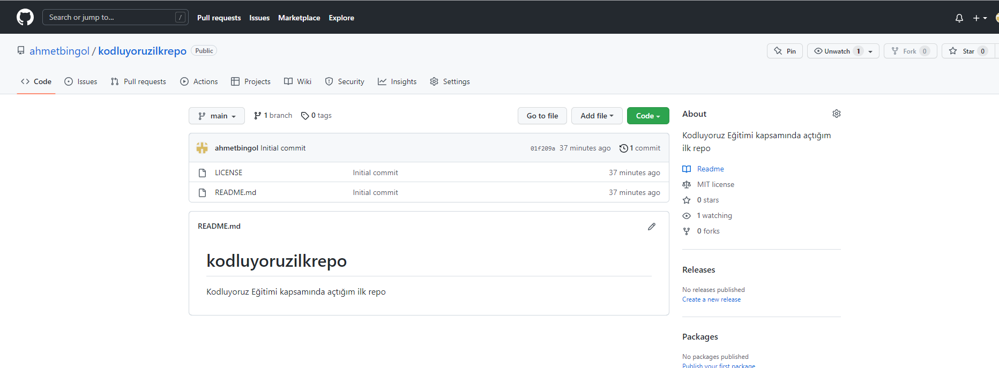

# kodluyoruzilkrepo

Bu repo Kodluyoruz Front-End Eğitiminde oluşturduğumuz ilk repo,içerisinde bir adet README dosyası, bir adet de index.html barındırıyor

## Installation
Öncelikle projeyi klonlayın
```bash
git clone git@github.com:ahmetbingol/kodluyoruzilkrepo.git
```

## Usage
Projeyi klonladıktan sonra Vİsual Studio Code programında açınız.
Linux için:
```bash
cd kodluyoruzilkrepo
code .
```
## Contributing
Pull requestler kabul edilir. Büyük değişiklikler için, lütfen önce neyi değiştirmek istediğinizi tartışmak için bir konu açınız.

## License
[MIT](https://choosealicense.com/licenses/mit/)
